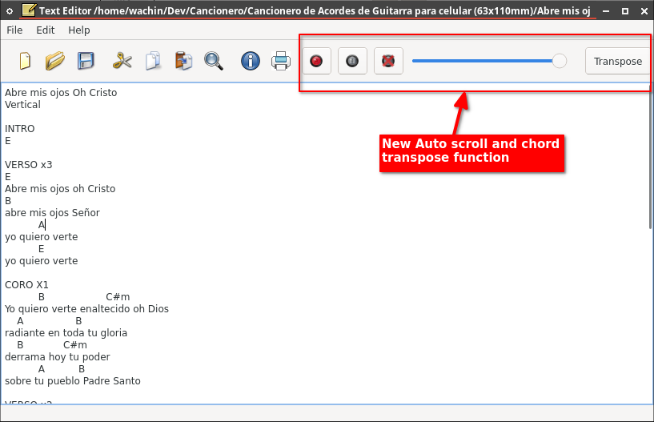

textEditor
==========

texteditor using QT

It's a simple TextEditor using QT (like Notepad) with C++. 

Minimal but complete functionality.


# New functions: Auto scroll and chord transpose




# Modified in Debian 12 x386 (32 bit)

This code is still in Alpha and has bugs. 

For Debian 12 32 bit you need the following to open the project:

---

# How to Install Qt Creator 9 on Debian 12 x386 32-bit

I was installing Qt Creator and encountered this message:

Can't add kits and can't choose Qt version in Qt Creator

Here are the keywords to search on Google:

There is no GCC as a compiler and is compatible with your version of Qt for Qt Creator

After consulting, I found that it is necessary to install several dependencies, otherwise, it won’t work.

Update your repositories:

```
sudo apt-get update
```

**Note:** This installation is for installing Qt Creator 9 from the Linux Debian 9 Distribution packages, not from Qt:

https://www.qt.io/offline-installers

https://www.qt.io/download-qt-installer

# Creating a Project in Qt

Here are the steps to create a new project in Qt Creator on Debian 12.

### 1. **Install Qt Creator and Qt**

- Open a terminal and run the following command to install Qt Creator and Qt libraries:

  ```
  sudo apt-get install cmake build-essential libqt5x11extras5-dev qt5-qmake \
  	dh-make qtbase5-dev-tools extra-cmake-modules qtdeclarative5-dev-tools \
  	qtdeclarative5-dev qtcreator qttools5-dev qttools5-dev-tools \
  	libqt5svg5-dev clang xterm cmake-extras qmlscene-qt6 qmlscene \
  	qml qmake6 qt6-base-dev qtcreator qmake6 libdbusmenu-qt5-dev
  ```

- I also add that in the following entry: https://web.stanford.edu/dept/cs_edu/resources/qt/install-linux they say you should install the following:

  ```
   sudo apt-get -y install build-essential openssl libssl-dev libssl1.0  \
  	libgl1-mesa-dev libqt5x11extras5 '^libxcb.*-dev' libx11-xcb-dev \
      libglu1-mesa-dev libxrender-dev libxi-dev libxkbcommon-dev \
      libxkbcommon-x11-dev
  ```

   but I tell you that it works without them when installing Qt Creator from the distribution packages.

- This will install both the Qt Creator IDE with the necessary libraries to develop applications in Qt.

### 2. **Open Qt Creator**

- Once installed, open Qt Creator from the applications menu or by running `qtcreator` in the terminal or from your applications.

### 3. **Create a New Project**

- In Qt Creator, click **"File"** > **"New Project"**.
- In the window that appears, select **"Qt Widgets Application"** if you want to create a desktop application with a graphical interface. (You can also select other types of projects like **"Qt Console Application"** or **"Qt Quick Application"** according to your needs.)
- Click **"Choose..."** after selecting the project type.

### 4. **Set Up the Project**

- **Project Name:** Enter a name for your project (No spaces)
- **Location:** Choose the location where you want to save the project **"Create in:"**
- Click **"Next"**.

### 5. **Set Up the Development Kit**

- **"Build System"** change the default option (CMake) to qmake (if you do not do this in Debian 12, the .pro file will not be created).

- Click **"Next"**.

- **"Details"** If you want, you can leave it as is **"Class Information"**

- Click **"Next"**.

- **"Translation"** If you want, you can choose a language

- Click **"Next"**.

- **Kits**, if everything went well, **"Desktop"** will be selected by default (if the aforementioned dependencies are not installed, Kits will not be available).

- Click **"Next"**.

- **"Summary"** You will see a list of files that will be added to .pro without which nothing can be done, for example:

  Files to be added in
  /home/wachin/Dev-Qt/Pruebas/ChordT:
  ChordT.pro
  ChordT_es_EC.ts
  main.cpp
  mainwindow.cpp
  mainwindow.h
  mainwindow.ui

### 6. **Finish the Project Setup**

- Review the project summary and click **"Finish"**.

### 7. **Build and Run the Project**

- Once you have created the project, Qt Creator will automatically open the development environment with your project files.

### **8. Manually Modify the Main Class**

1. **Open Project Files:**

   - Once the project is created, in the **"Projects"** panel on the left side, expand the **"Sources"** and **"Headers"** folders to see the `.cpp` and `.h` files.

2. **Modify `main.cpp`:**

   - Open the `main.cpp` file. This file contains the entry point of your application.

   - If you are using `QMainWindow` as the main window, the code will look something like this:

     ```cpp
     #include "mainwindow.h"
     #include <QApplication>
     
     int main(int argc, char *argv[]) {
         QApplication a(argc, argv);
         MainWindow w;
         w.show();
         return a.exec();
     }
     ```

3. **Modify `mainwindow.h` and `mainwindow.cpp`:**

   - Open `mainwindow.h` and `mainwindow.cpp` to edit the main window class.

   - If you need to add additional widgets or customize the main window, you can do so here. The `MainWindow` class should inherit from `QMainWindow`, and it will typically look like this in the `mainwindow.h` file:

     ```cpp
     #ifndef MAINWINDOW_H
     #define MAINWINDOW_H
     
     #include <QMainWindow>
     
     namespace Ui {
     class MainWindow;
     }
     
     class MainWindow : public QMainWindow {
         Q_OBJECT
     
     public:
         explicit MainWindow(QWidget *parent = nullptr);
         ~MainWindow();
     
     private:
         Ui::MainWindow *ui;
     };
     
     #endif // MAINWINDOW_H
     ```

   - In `mainwindow.cpp`, the interface is built and configured:

     ```cpp
     #include "mainwindow.h"
     #include "ui_mainwindow.h"
     
     MainWindow::MainWindow(QWidget *parent) :
         QMainWindow(parent),
         ui(new Ui::MainWindow) {
         ui->setupUi(this);
     }
     
     MainWindow::~MainWindow() {
         delete ui;
     }
     ```

4. **Design the Graphical Interface (`mainwindow.ui`):**

   - Open `mainwindow.ui` in the Qt Creator graphical design editor. Here you can drag and drop widgets to design your application's visual interface.
   - To build the project, click the **"Build"** button or press `Ctrl + B`.
   - To run the project, click the **"Run"** button or press `Ctrl + R`.

### 8. **Modify and Add Code**

- You can start modifying the main file (`main.cpp`) and the main window (`mainwindow.ui` and `mainwindow.cpp`) to develop your application.

### 9. Open Application Written in Qt

- Close Qt Creator and reopen it.

- Clone the following repository into a directory (you must have git installed):

  ```
  git clone https://github.com/pr-ravi/TextEditor-Qt
  ```

- In Qt Creator, click **"File"** > **"Open File or Project..."** and find the file:

  **textEditor.pro**

- In the window that appears, click **"Configure Project"** and on the left side under **"Projects"** in **"textEditor.pro (Master)"** find the file: **textEditor.pro.pro** by double-clicking it to open, then click:

- **"Build"** > **"Build Project textEditor.pro"** and in the bottom right corner, you will see the build information; when it turns green, it's done and click on:

- **"Build"** > **"Run"**

and the program will open.

God bless you

### Inquiries:

**How to install qt version?(for Linux)**
<https://forum.qt.io/topic/116658/how-to-install-qt-version-for-linux>

**Install ksnip 1.9.0 on Linux from source code 32 and 64 bits (cmake prefix towards /usr**
<https://facilitarelsoftwarelibre.blogspot.com/2021/03/compilar-ksnip-desde-codigo-fuente-en-linux.html>

**"No QML utility installed" not letting me use Qt6**
<https://forum.qt.io/topic/145219/no-qml-utility-installed-not-letting-me-use-qt6/9>
sudo apt install qml-qt6

**Another way to fix the QML issue**
<https://gist.github.com/HiAmon/15bcb4c4e3fe2984ab78e84ef79e48a5>

**Getting Started With Qt and Qt Creator on Linux**  
By Jeff Tranter Wednesday, October 12, 2016  
[https://www.ics.com/blog/getting-started-qt-and-qt-creator-linux](https://www.ics.com/blog/getting-started-qt-and-qt-creator-linux)  
sudo apt-get install build-essential libgl1-mesa-dev  

**clazy**  
[https://github.com/KDE/clazy](https://github.com/KDE/clazy)  
Ubuntu: sudo apt install g++ cmake clang llvm-dev git-core libclang-dev  

**Ubuntu 22.04 with Qt6 - qmake: could not find a Qt installation of ''**  
[https://askubuntu.com/questions/1460242/ubuntu-22-04-with-qt6-qmake-could-not-find-a-qt-installation-of](https://askubuntu.com/questions/1460242/ubuntu-22-04-with-qt6-qmake-could-not-find-a-qt-installation-of )  

**How to Compile Qt from Source Code on Linux**  
By Jeff Tranter Wednesday, January 4, 2017  
[https://www.ics.com/blog/how-compile-qt-source-code-linux](https://www.ics.com/blog/how-compile-qt-source-code-linux )  

[https://vitux.com/compiling-your-first-qt-program-in-ubuntu/](https://vitux.com/compiling-your-first-qt-program-in-ubuntu/)  
sudo apt-get install qt5-doc qtbase5-examples qtbase5-doc-html  

**Instalando dmidiplayer 1.7.0 en MX Linux 21 de 32 o 64 bits desde código fuente**  
[https://facilitarelsoftwarelibre.blogspot.com/2022/10/instalando-dmidiplayer-1.7-en-mx-linux-21-desde-src.html](https://facilitarelsoftwarelibre.blogspot.com/2022/10/instalando-dmidiplayer-1.7-en-mx-linux-21-desde-src.html )  